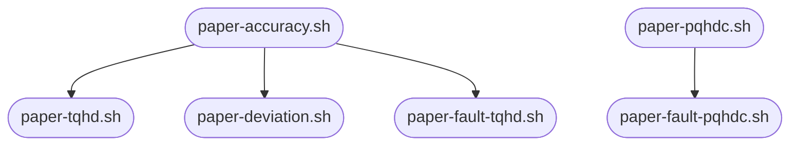

# TQHD

[toc]

## Setup

Clone this repository and init submodules.
```bash
git sumodule update --init --recursive
```

This repository relies on Python, pip, virtual environments and GNU parallel to run model training. If you are on Ubuntu 22.04, you can simply run `./setup.sh` to download dependencies and set up the environment. If not, then you must download dependencies and setup the virtual environment as done in `setup.sh` script:
```bash
# Download dependencies
sudo apt install -y python3 pip3 python3-venv parallel
# Create virtual environment and download packages
python3 -m venv _venv
source _venv/bin/activate
# Install python requirements
pip install -r requirements.txt
# Enable torchhd submodule in the virtual environment
pip install -e torchhd
deactivate
```

After installing the dependencies, test the installation by executing all models and download their datasets:
```
./paper-datasets.sh
```

If `paper-datasets.sh` runs correctly, then you environment is ready to run the experiments.

## Launching Experiments

There are several scripts to handle the experiments and they must be executed in a proper order.

```
./paper-accuracy.sh # Executed
./paper-tqhd.sh # Fixed and executed
./paper-pqhdc.sh
```

Each script can be executed in parallel and you can choose whether it should use Cuda. Please make sure to tune the paremeters `JOBS` and `DEVICE` in each script according to your machine. Have in mind that launching multiple jobs in simultaneously requires not only CPU/GPU but also memory available. The best parameters must be found.


## Repository Explained

### Generated Directories

All diretories starting with "\_" are considered *private*, and thus, handled by the repository.

| Folder           | Meaning                                                |
| :--------------: | :----------------------------------------------------: |
| \_accuracy       | Accuracy of unquantized models                         |
| \_data           | Downloaded datasets                                    |
| \_pool           | Trained models serialized to files                     |
| \_transformation | Accuracy of transformed, i.e., quantized, models       |
| \_venv           | Python virtual environment                             |

### Scripts

Each script follows a similar structure:

```bash
#!/bin/bash

# Script description #
# Explain the purpose of the script

# Variable set up #
# Define script's sariables and set execution environment
...
JOBS=10
DEVICE=cuda
...

# Helper function #
# Help launching experiments

# Applications #
# Function to launch each set of experiments of an application. Each function prints commands to all necessary experiments

# Launcher #
# Enable Python virtual environment
enable_venv
# Create command batch
cmd=""
cmd+=$(voicehd)
cmd+=$(emg)
cmd+=$(mnist)
cmd+=$(language)

# Debug function to print the command list
#printf "$cmd"
# Launch all experiments in $JOBS parallel jobs. Using --halt now,fail=1 to abort script execution if any job fails.
printf "$cmd" | parallel --verbose -j$JOBS --halt now,fail=1
# Disable Python virtual environment
disable_venv
```

### Model Pool

This repository takes advantage of model serialization to reduce training time. The idea is to train a model only once, serialize it into `_model` and reuse its trained parameters as much as possible. For instance, a trained MAP floating-point model created by `paper-accuracy.sh` is used by `paper-tqhd.sh` to speed up TQHD evaluation since TQHD is a Post-Training Quantization (PTQ) method. The use of model pool creates the following dependency graph in script execution order:


